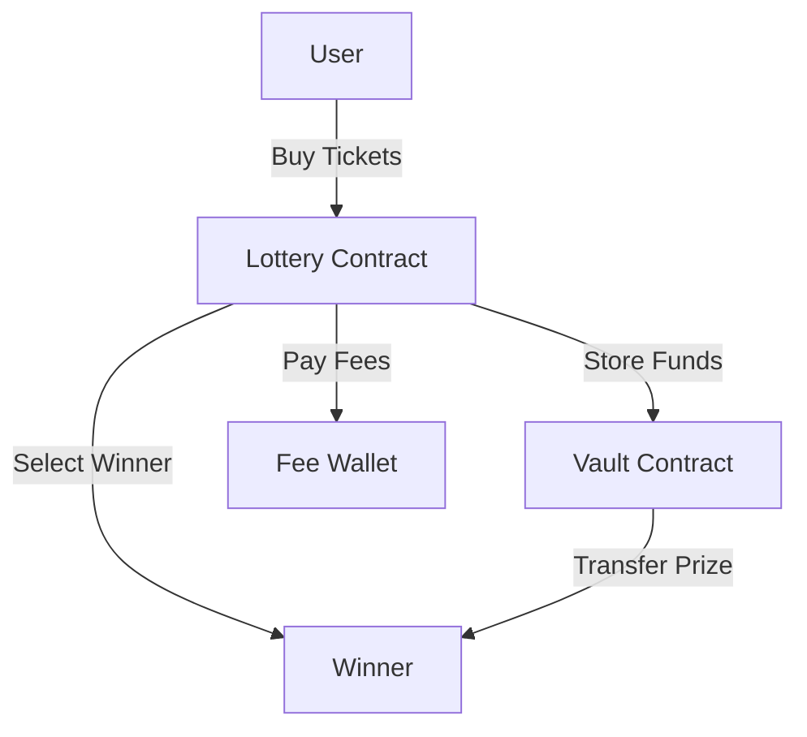

# Ethereum Lottery Smart Contract

A decentralized lottery system built on Ethereum, featuring automated draws, secure prize pools, and transparent winner selection.

## Features

- 🎫 Ticket purchasing system
- 💰 Secure prize pool management via separate vault contract
- 🔄 Automated lottery rounds
- 🎯 Fair winner selection
- 💸 Configurable fees and ticket prices
- 🔒 Time-locked draws

## Smart Contracts

- `Lottery.sol`: Main lottery logic
- `VaultWallet.sol`: Secure prize pool management

## Prerequisites

- Node.js >= 18
- npm >= 9

## Installation

1. Clone the repository
```bash
git clone <repository-url>
cd ethereum-lottery
```

2. Install dependencies
```bash
npm ci
```

3. Create a `.env` file:
```env
INFURA_API_KEY=your_infura_key
PRIVATE_KEY=your_private_key
ETHERSCAN_API_KEY=your_etherscan_key
```

## Testing

Run the test suite:
```bash
npx hardhat test
```

Get coverage report:
```bash
npx hardhat coverage
```

## Development

1. Deploy to local network:
```bash
npx hardhat node
npx hardhat npx hardhat ignition deploy ignition/modules/contract.ts --network localhost

```


## Security

- ✅ Reentrancy protection
- ✅ Separate prize pool vault
- ✅ Time-locked operations
- ✅ Owner-only administrative functions
- ✅ Fee management

## Architecture



## Contract Interaction

1. Owner starts new draw:
```typescript
await lottery.startNewDraw();
```

2. Users buy tickets:
```typescript
await lottery.buyTickets(numberOfTickets, {
    value: ticketPrice * numberOfTickets
});
```

3. Owner selects winner:
```typescript
await lottery.selectWinner();
```

## Contributing

1. Fork the repository
2. Create your feature branch (`git checkout -b feature/amazing-feature`)
3. Commit your changes (`git commit -m 'Add some amazing feature'`)
4. Push to the branch (`git push origin feature/amazing-feature`)
5. Open a Pull Request

## License

MIT License - see the [LICENSE](LICENSE) file for details

